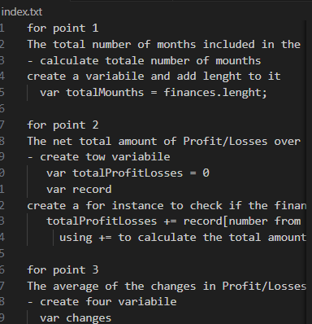
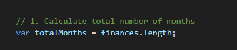
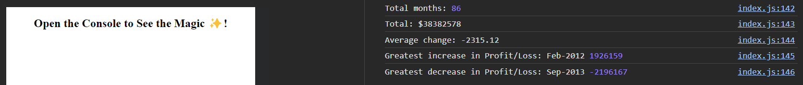

 # Console-Finances
## Description

- To learn more about javaScript sudocode and how it works.
- This is a simple example of how to use javaScript to create a banking control program.
- It ca be use to create a program that will chec the business of worting.
- To use to tipe of for loop and how to create a good sudocode.

## Installation

https://costinel22.github.io/Console-Finances/

Open on Chrome, clik righr and chose inspect, go at console and refresh the page.
## Usage
- Here it ca see a description of sudocode.

- Here it se firs recuestring to count the number of mounts.

## Credits
https://developer.mozilla.org/en-US/docs/Web/JavaScript/Reference/Statements/for...of

https://www.w3schools.com/jsref/jsref_tofixed.asp

## License

MIT

## Tests
Open on Chrome, clik righr and chose inspect, go at console and refresh the page.
The result it will be like in this picture.
